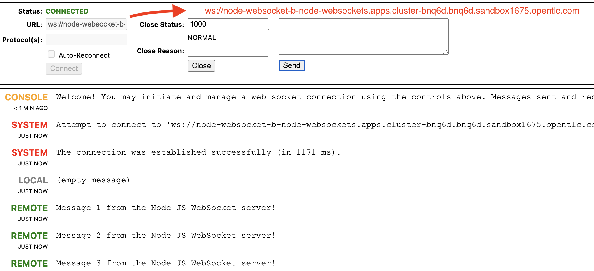
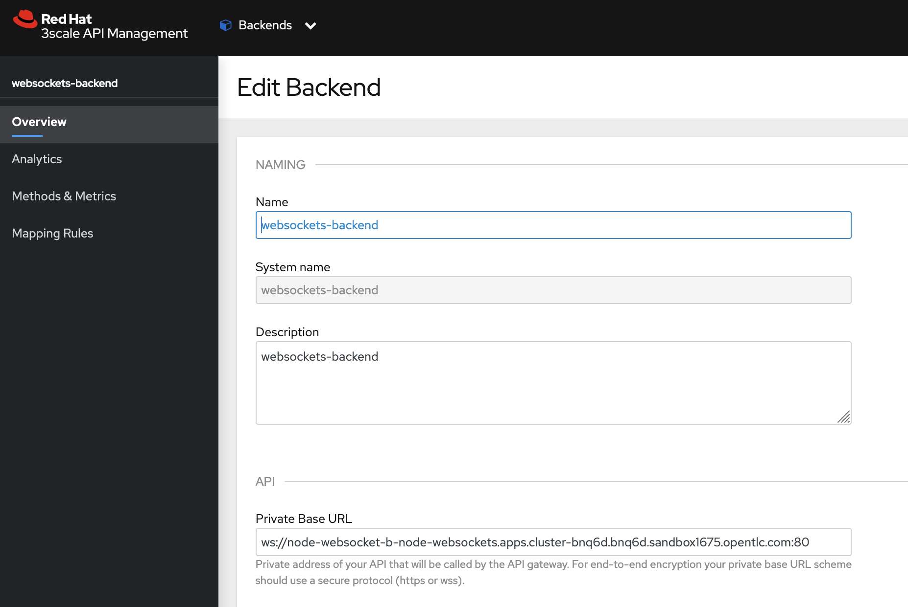
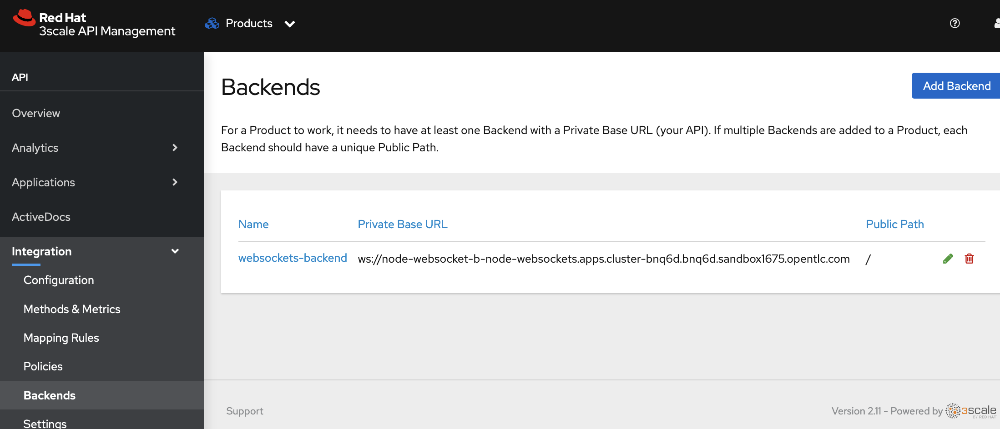
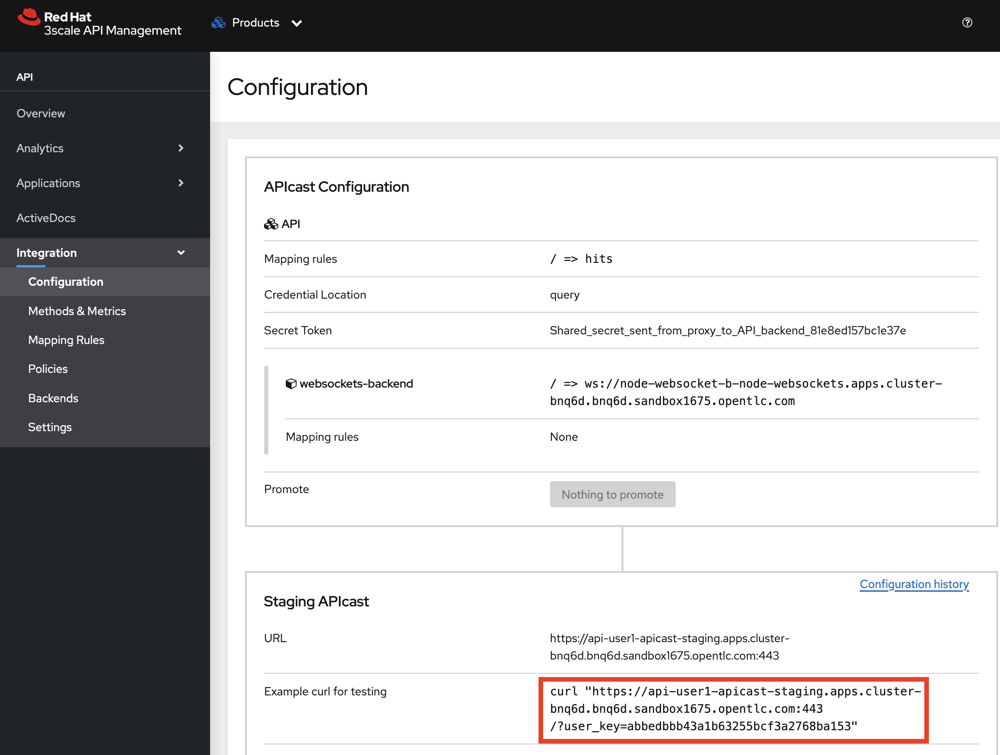

# Failed call to Websockets API via 3scale

## 1 Call direct to Websockets API succeeds

## 2 3scale backend config

## 3 3scale backend added to product

## 4 3scale config promoted to Staging

## 5 Websockets call via APICast fails

