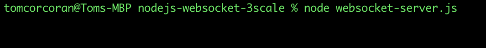
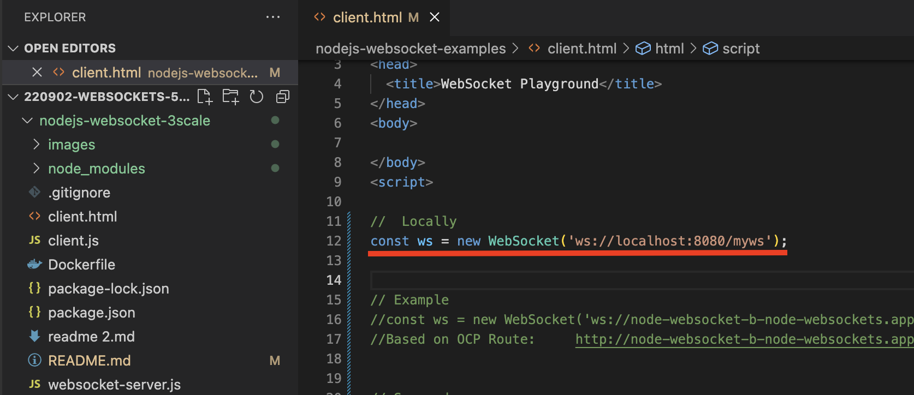
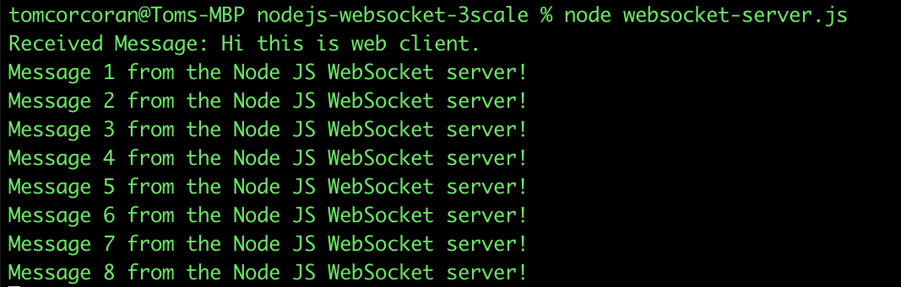

# Nodejs Websocket 3scale

An example Websocket API protected by 3scale, deployed on OpenShift Container Platform
Based on git hub repo ajb413 nodejs-websocket-examples. Thanks guys.
### Prerequisites
- Access to an OpenShift Server. 
If you don't have one, you can install OpenShift Local on your laptop.
- Access to a 3scale instance. 
If you don't have one, you can install a community version, from the Operator Hub within your OpenShift instance

## Install API Locally

```
git clone https://github.com/tnscorcoran/nodejs-websocket-3scale
cd nodejs-websocket-3scale
export REPO_HOME=`pwd`
```

### Install NodeJs if necessary and install modules
```
npm install
```

### Start local server
```
node websocket-server.js
```
It will appear like this - listening for requests:
 


### Modify client.html and call your local Node Js server
Open client.html, uncomment the line that calls *localhost* and save the file.
 

Drag client.html to a browser like Chrome. Right click and click ***Inspect***. Click ***Console***. You'll see every 4 seconds a new message from the web socket server.

 


Similarly, your server terminal will also be updating:
 


Close your server by typing 
```
CTRL + c
```

## Install Websockets API on OpenShift

### Push to a public registry like Dockerhub
Do the following
 - If you don't have one, create a free account on a public registry like DockerHub. 
 - If necessary install a Docker client (or podman) on your laptop.
 - Start the Docker client on your laptop
 - Now login to Dockerhub on a terminal - with your credentials
```
docker login
``` 

Think of a name for your websockets server app, e.g. ***my-websockets-api***. Run the following, replacing ***my-websockets-api*** with your API name and ***mydockerusername*** with your actual username
```
docker build . -t mydockerusername/my-websockets-api:latest
docker tag mydockerusername/my-websockets-api:latest mydockerusername/my-websockets-api:latest
docker push mydockerusername/my-websockets-api:latest
```

After a few minutes, this should be pushed to Dockerhub where you will see it under the *Repositories* menu once logged in.

## Install Websockets API on OpenShift

mydockerusername/my-websockets-api